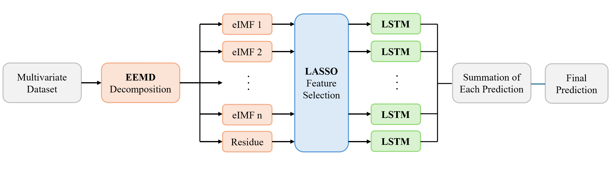
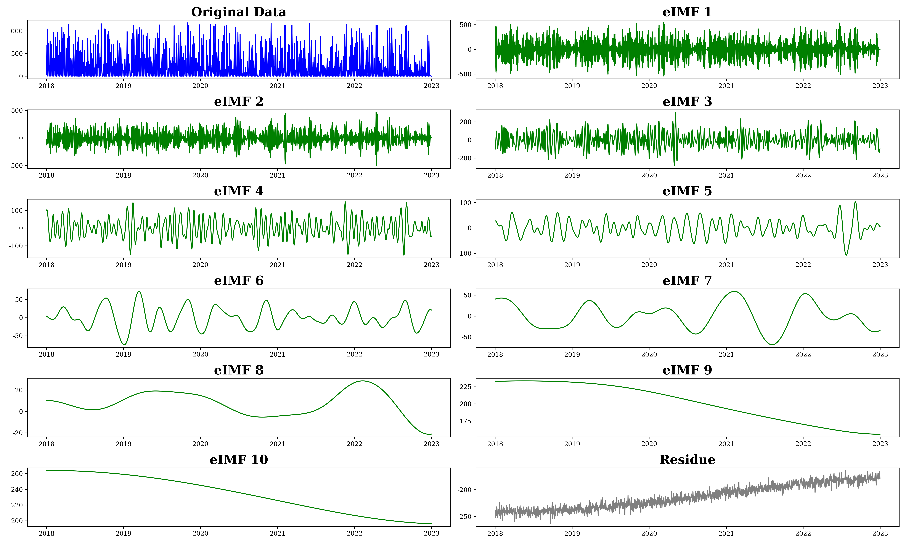
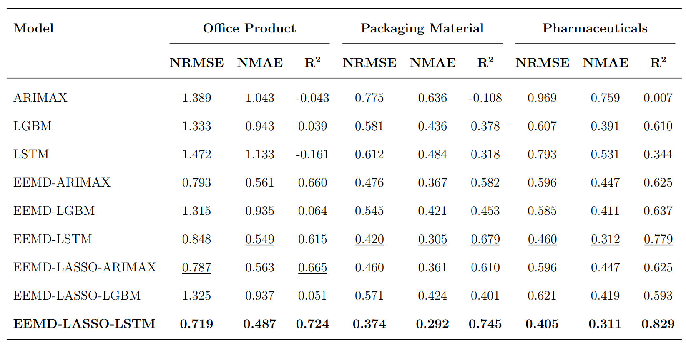

# EEMD-LASSO-LSTM: Hybrid Model for Time Series Forecasting
📌 **Official Code for the Paper: "Methodology for Advanced Time Series Demand Forecasting: A Hybrid Model of Decomposition and Deep Learning"**  
📌 **Authors**: Juyoung Ha, Sungwon Lee, Sooyeon Jeong, Doohee Chung  

---

## 🚀 Overview
This repository contains the implementation of the **EEMD-LASSO-LSTM** model, a novel hybrid approach for demand forecasting. Our methodology integrates:
1. **EEMD**: Decomposes time-series data into multiple frequency components.
2. **LASSO**: Selects the most relevant features.
3. **LSTM**: Captures long-term dependencies in demand fluctuations.

### **Model Architecture**
Below is the architecture of our proposed model:

---

## 📊 **EEMD Decomposition Results**
Our model first applies **Ensemble Empirical Mode Decomposition (EEMD)** to break down the original time-series data into multiple **Intrinsic Mode Functions (IMFs)** and a residual component.

---

## 📈 **Benchmark Results**
The following table summarizes the performance of **EEMD-LASSO-LSTM** compared to various baseline models:

✅ **EEMD-LASSO-LSTM achieves the lowest NRMSE across all industries, demonstrating superior predictive accuracy.**
